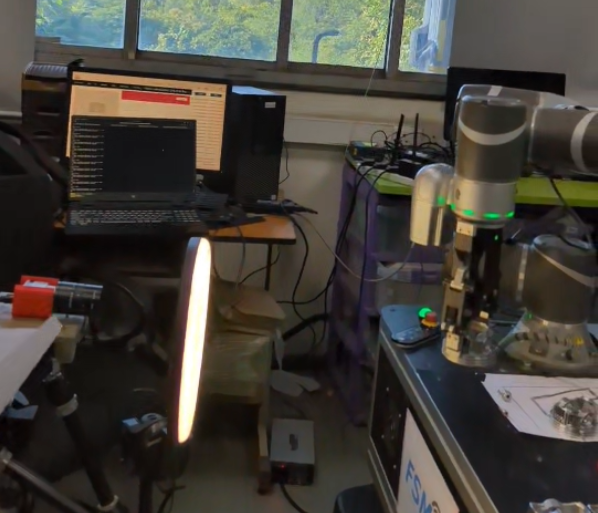
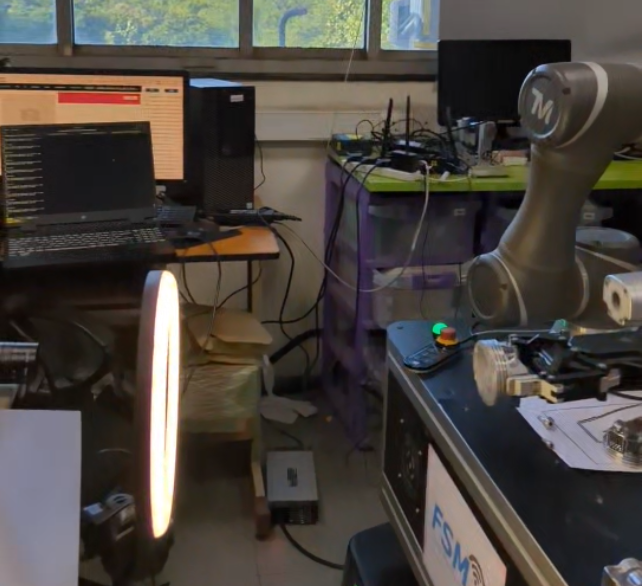
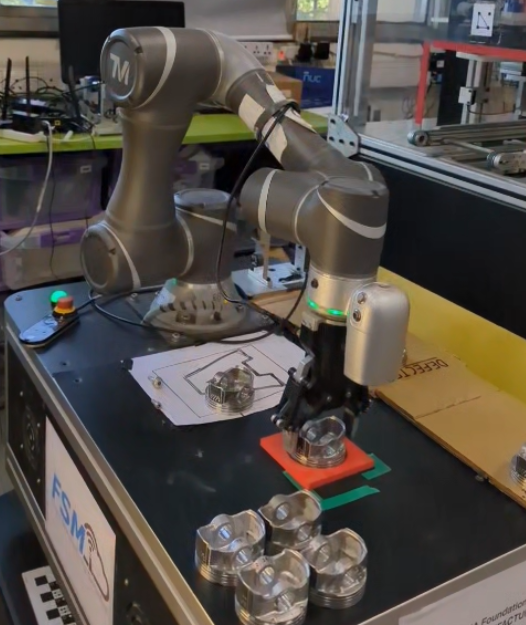
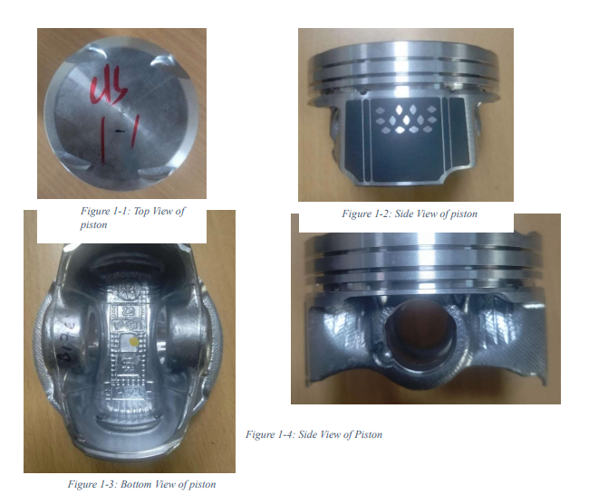
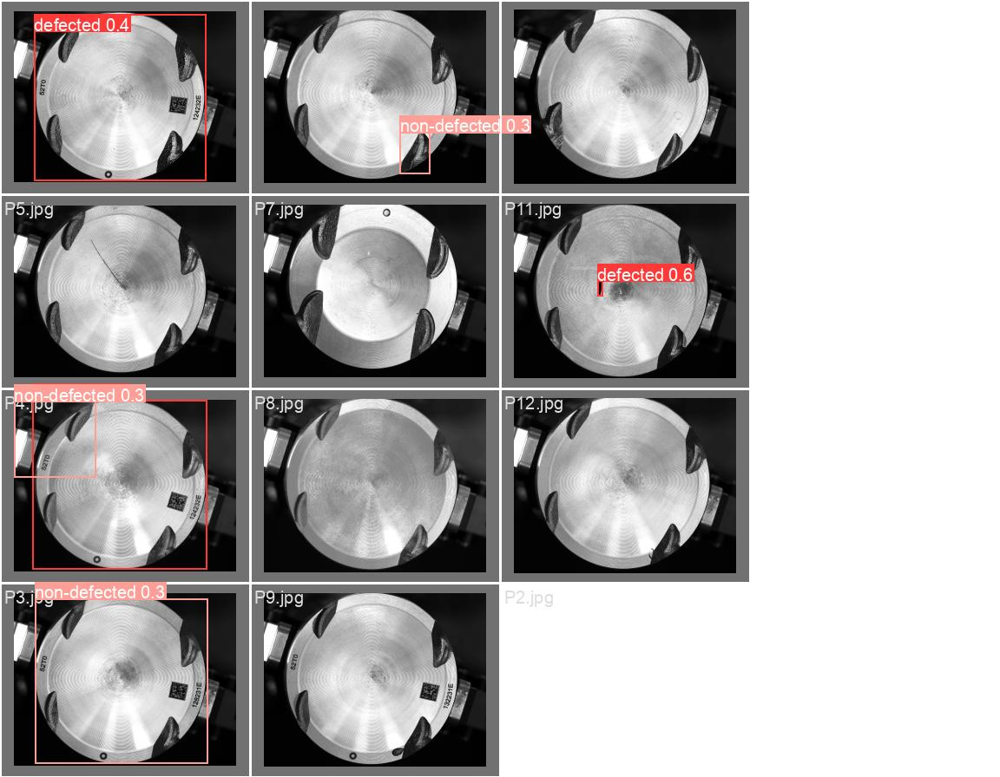

# 🔎 Automated Piston Inspection with Collaborative Robotics and Machine Learning

## 📌 Overview
The **Piston Inspection Project** is an automated quality control solution that integrates:
- **Collaborative robotics (Cobot)**
- **High-quality imaging**
- **YOLOv8-based defect detection**  

It replaces slow, error-prone manual inspections with a **fast, repeatable, and scalable** automated pipeline.  
**Inspection time reduced** to **33 seconds per piston** in prototype trials.

---

## 🚀 Key Features
- **Automatic multi-view imaging** with precise Cobot positioning and rotation
- **Basler ace** high-resolution camera with optimized lighting, polarizer, and diffuser
- **Industry-aligned dataset** with load zones, defect types, and acceptance limits
- **YOLOv8** retrained for subtle piston defect detection
- **ROS + TM ROS Driver** integration for cobot control
- Results stored in a structured **database** for traceability

---

## 🛠 System Workflow
1. **Piston Handling:**  
   Cobot grips and rotates the piston to capture views from **multiple angles**.

2. **Imaging:**  
   Basler ace camera + controlled lighting capture high-contrast images.

3. **Preprocessing:**  
   Convert to **grayscale** for enhanced defect visibility.

4. **ML Inference:**  
   YOLOv8 model detects and classifies defects based on load zones & acceptance limits.

5. **Results Logging:**  
   Store annotated images and classification results in the database.

---

## 🖥 Hardware Setup
- **Cobot:** Collaborative robot arm with ROS control
- **Camera:** Basler ace high-resolution industrial camera
- **Lighting:** Consistent setup with polarizer & diffuser to remove glare
- **Fixture:** Stable piston mount for repeatable imaging
- **Rotation:** Pre-calculated angles for full coverage

---

## 📊 Dataset & Labeling
- **Load Zones:**  
  - **Red:** High-stress areas (strictest inspection)  
  - **Yellow:** Medium stress  
  - **Green:** Low stress
- **Defect Types:** Annotated for classification
- **Acceptance Limits:** Defined per defect type for pass/fail decisions

---

## 🤖 Machine Learning Model
- **Base Model:** YOLOv8 object detection
- **Training:** Custom dataset of piston images
- **Preprocessing:** Grayscale conversion
- **Thresholds:** Tuned for industry acceptance criteria
- **Deployment:** Integrated into ROS pipeline for live inference

---

## 🔧 Cobot Integration
- **ROS Workspace:** Contains scripts, drivers, and protocols
- **TM ROS Driver:** Reliable robot–ROS communication
- **TMFlow Program:** Step-by-step piston positioning & capture workflow
- **Database Link:** Store and retrieve inspection data automatically

---

## 📈 Results
- **Inspection Speed:** ~33 seconds per piston
- **Defect Detection Accuracy:** High accuracy on critical defect types

## 📷 Project Images

| Cobot Operation 1 | Cobot Operation 2 | Cobot Operation 3 |
|-------------------|-------------------|-------------------|
|  |  |  |

| Piston Sample | ML Detection Result |
|---------------|---------------------|
|  |  |

---

## 🚀 Getting Started

### Prerequisites
- **Python 3.9+**
- **ROS (Noetic/Humble)** with TM ROS Driver installed
- **Docker** (optional, for containerized deployment)

### Install Python Dependencies
```bash
pip install ultralytics opencv-python numpy matplotlib pyyaml tqdm pandas
